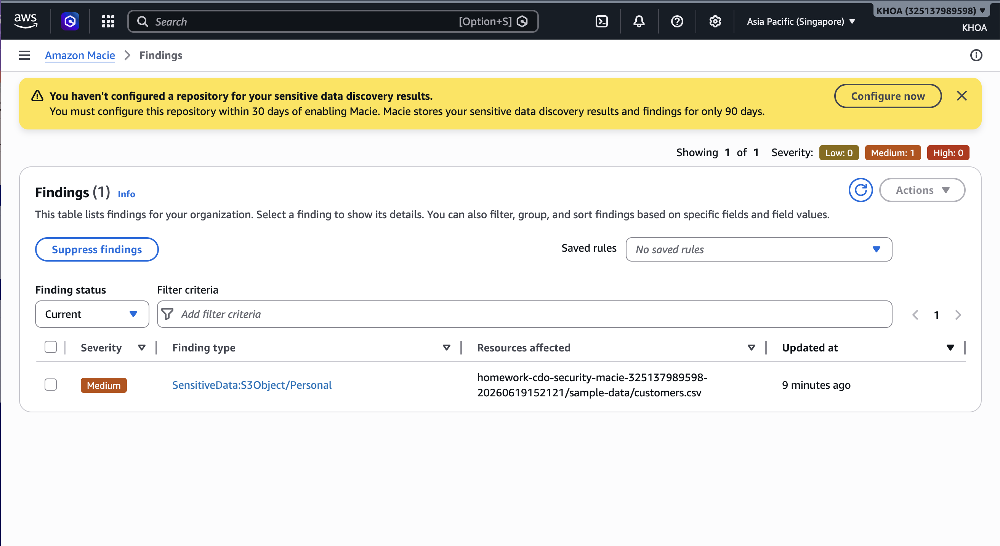
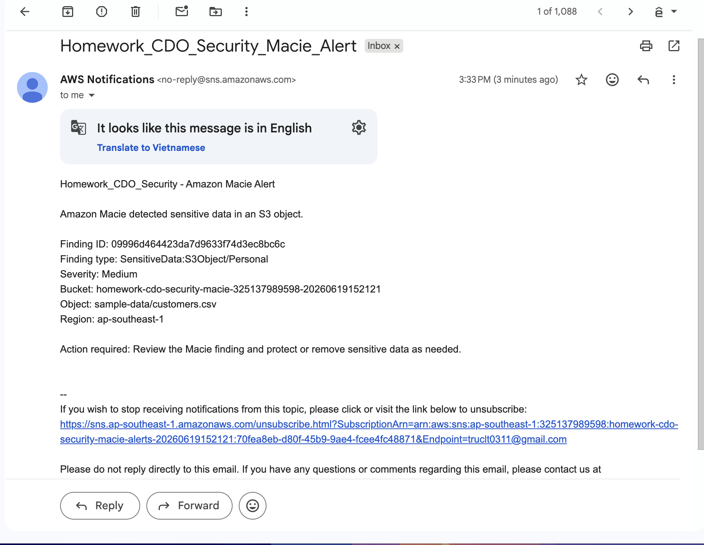

# Homework_CDO_Security

## Lab: Detect sensitive data in Amazon S3 buckets and send notifications using Amazon Macie

### AWS resources

- Account: `325137989598`
- Region: `ap-southeast-1`
- S3 bucket: `homework-cdo-security-macie-325137989598-20260619152121`
- Macie job: `homework-cdo-security-macie-job-20260619152121`
- Macie job ID: `a934b5a42040d3b08df279bb4d52173d`
- Macie finding ID: `09996d464423da7d9633f74d3ec8bc6c`
- SNS topic: `arn:aws:sns:ap-southeast-1:325137989598:homework-cdo-security-macie-alerts-20260619152121`
- EventBridge rule: `homework-cdo-security-macie-findings-20260619152121`
- Email subscription: `truclt0311@gmail.com`

### Result

Amazon Macie detected sensitive data in:

- Object: `sample-data/customers.csv`
- Finding type: `SensitiveData:S3Object/Personal`
- Severity: `Medium`
- Description: `The S3 object contains personal information`

### Evidence screenshots

Required screenshots:

1. Macie finding screen.



2. SNS email notification screen.



### Console links

- [Macie findings](https://ap-southeast-1.console.aws.amazon.com/macie/home?region=ap-southeast-1#findings)
- [Macie classification jobs](https://ap-southeast-1.console.aws.amazon.com/macie/home?region=ap-southeast-1#classification-jobs)
- [SNS subscriptions](https://ap-southeast-1.console.aws.amazon.com/sns/v3/home?region=ap-southeast-1#/subscriptions)
- [EventBridge rules](https://ap-southeast-1.console.aws.amazon.com/events/home?region=ap-southeast-1#/rules)
- [S3 bucket](https://s3.console.aws.amazon.com/s3/buckets/homework-cdo-security-macie-325137989598-20260619152121?region=ap-southeast-1)

### Submission link

After adding screenshots and pushing to GitHub, submit this public link:

```text
https://github.com/anons2003/anons2003-aws-accelerator-p2/tree/main/Homework_CDO_Security
```
