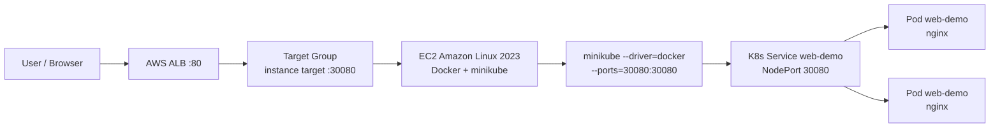

# K8s Web Demo

Đây là một web app tĩnh nhỏ dùng để luyện Docker, minikube, Kubernetes
Deployment, Kubernetes Service và AWS ALB routing.

App có thể chạy theo 3 cách:

- Chạy local bằng Docker.
- Chạy local trong minikube.
- Deploy lên AWS bằng Terraform: EC2 chạy Docker + minikube, app chạy bên trong Kubernetes, ALB public route traffic vào app.

Điểm quan trọng: app không được cài trực tiếp lên EC2. EC2 chỉ là máy host để chạy Docker và minikube. Web app thật sự chạy trong Kubernetes dưới dạng Deployment.

## Cấu trúc repo

```text
k8s-web-demo/
  index.html
  styles.css
  Dockerfile
  nginx.conf
  k8s/
    deployment.yaml
    service.yaml
  terraform/
    versions.tf
    main.tf
    variables.tf
    outputs.tf
    user_data.sh
```

Ý nghĩa nhanh:

- `index.html`, `styles.css`: nội dung web demo.
- `Dockerfile`, `nginx.conf`: đóng gói web demo thành nginx container image.
- `k8s/deployment.yaml`: chạy app trong Kubernetes bằng Deployment.
- `k8s/service.yaml`: expose app bằng Service kiểu NodePort.
- `terraform/`: tạo EC2, Security Group, ALB, Target Group và deploy app lên EC2.

## Kiến trúc



Luồng request:

```text
Internet -> ALB :80 -> EC2 :30080 -> minikube -> K8s Service -> web-demo Pods
```

Giải thích:

- User truy cập ALB bằng browser qua port `80`.
- ALB forward request tới EC2 qua port `30080`.
- Port `30080` trên EC2 được minikube map vào Kubernetes NodePort.
- Kubernetes Service chuyển request tới các Pod của app.

## Chạy local bằng Docker

Chạy từ thư mục gốc repo `k8s-web-demo/`:

```bash
docker build -t k8s-web-demo:local .
docker run --rm -p 8080:80 k8s-web-demo:local
```

Mở browser:

```text
http://localhost:8080
```

Dừng container bằng `Ctrl+C`.

## Chạy local trong minikube

Build image:

```bash
docker build -t k8s-web-demo:local .
```

Load image vào minikube:

```bash
minikube image load k8s-web-demo:local
```

Deploy vào Kubernetes:

```bash
kubectl apply -f k8s/
kubectl get deploy,svc,pods -l app=web-demo
```

Mở app:

```bash
minikube service web-demo --url
```

Xóa resource local sau khi test:

```bash
kubectl delete -f k8s/
```

## Deploy lên AWS bằng Terraform

Yêu cầu:

- Máy local đã cài Terraform.
- AWS credentials đã cấu hình đúng.
- Region có default VPC, ví dụ `ap-southeast-1`.
- AWS account còn quota để tạo 1 EC2 instance và 1 Application Load Balancer.

Nếu credentials nằm trong AWS CLI profile tên `k8s`, kiểm tra trước:

```bash
aws sts get-caller-identity --profile k8s
export AWS_PROFILE=k8s
```

Lấy public IP hiện tại của bạn để chỉ mở SSH cho IP đó:

```bash
curl https://checkip.amazonaws.com
```

Tạo file `terraform/terraform.tfvars`:

```hcl
aws_region = "ap-southeast-1"

ssh_cidr_blocks = ["YOUR_PUBLIC_IP/32"]
```

Ví dụ:

```hcl
aws_region = "ap-southeast-1"

ssh_cidr_blocks = ["1.55.47.68/32"]
```

Chạy Terraform từ đúng thư mục `terraform/`:

```bash
cd terraform
terraform init
terraform fmt
terraform validate
terraform plan
terraform apply
```

Không chạy `terraform apply` ở thư mục gốc `k8s-web-demo/`, vì thư mục đó không có file `.tf`. Nếu chạy sai chỗ, Terraform sẽ báo:

```text
Error: No configuration files
```

Sau khi apply xong, lấy URL public của app:

```bash
terraform output -raw app_url
```

Mở URL đó trên browser. Trang đúng sẽ hiển thị `K8s Web Demo`.

## Kiểm tra khi Terraform bị kẹt

Lấy lệnh SSH do Terraform in ra:

```bash
terraform output -raw ssh_command
```

SSH vào EC2, rồi kiểm tra:

```bash
docker ps
minikube status
kubectl get nodes
kubectl get deploy,svc,pods -l app=web-demo
curl http://localhost:30080
```

Kiểm tra log bootstrap trên EC2:

```bash
sudo tail -100 /var/log/k8s-web-demo-bootstrap.log
ls -l /var/log/k8s-web-demo-bootstrap.done
```

Nếu chưa có file `.done`, nghĩa là script bootstrap chưa chạy xong hoặc đã lỗi.

## Cách các Terraform provider được nối với nhau

Stack này dùng 4 provider:

```text
aws   -> tạo hạ tầng AWS
tls   -> tạo SSH key tạm thời
local -> ghi private key ra máy local
null  -> upload app và chạy lệnh deploy qua SSH
```

### Provider `aws`

Provider `aws` tạo các resource cloud:

- Tìm default VPC và public subnet bằng data source.
- Tạo EC2 chạy Amazon Linux 2023.
- Tạo Security Group cho ALB, SSH và NodePort.
- Tạo ALB listen HTTP port `80`.
- Tạo Target Group forward vào EC2 port `30080`.

Kết nối quan trọng:

```text
aws_lb_listener.http -> aws_lb_target_group.app -> aws_instance.k8s:30080
```

Nói ngắn gọn:

- Listener của ALB nhận request từ Internet.
- Listener chuyển request vào Target Group.
- Target Group gọi EC2 ở port `30080`.
- Port `30080` đi vào minikube và tới Kubernetes Service.

### Provider `tls` và `local`

Provider `tls` tạo SSH key:

```text
tls_private_key.ssh
```

Public key được đăng ký lên AWS:

```text
aws_key_pair.demo
```

Private key được provider `local` ghi ra máy local:

```text
terraform/.generated/k8s-web-demo.pem
```

Terraform dùng chính key này để SSH vào EC2.

### Provider `null`

`null_resource.deploy_app` là phần nối giữa hạ tầng và app.

Nó chờ EC2 bootstrap xong:

```bash
while [ ! -f /var/log/k8s-web-demo-bootstrap.done ]; do sleep 5; done
```

Sau đó upload các file app:

```text
Dockerfile
index.html
styles.css
nginx.conf
k8s/deployment.yaml
k8s/service.yaml
```

Rồi chạy trên EC2:

```bash
minikube status || minikube start --driver=docker --ports=30080:30080 --cpus=2 --memory=2600
docker build -t k8s-web-demo:local .
minikube image load k8s-web-demo:local
kubectl apply -f k8s/
kubectl rollout status deploy/web-demo --timeout=180s
```

`triggers` hash các file app. Nếu sửa app hoặc manifest Kubernetes, Terraform biết cần chạy lại bước deploy.

## Vì sao dùng port 30080

Kubernetes Service dùng NodePort cố định:

```yaml
nodePort: 30080
```

Minikube map port đó từ container minikube ra EC2 host:

```bash
minikube start --driver=docker --ports=30080:30080
```

ALB Target Group forward tới đúng port đó trên EC2:

```text
Target type: instance
Protocol: HTTP
Port: 30080
```

Vì vậy ALB có thể chạm được app nằm bên trong minikube.

## Security Group cần đúng gì

ALB Security Group:

```text
Inbound:
  HTTP 80 from 0.0.0.0/0

Outbound:
  Allow all, hoặc ít nhất allow tới EC2 port 30080
```

EC2 Security Group:

```text
Inbound:
  SSH 22 from YOUR_PUBLIC_IP/32
  Custom TCP 30080 from ALB Security Group

Outbound:
  Allow all
```

Không nên để EC2 port `30080` mở public `0.0.0.0/0` lâu. Chỉ dùng cách đó để test nhanh. Khi đã có ALB Security Group thì sửa source của rule `30080` thành ALB Security Group.

Lưu ý khi nhập Security Group ID trong AWS Console:

- Nếu Source type là `Custom`, bạn có thể nhập CIDR như `0.0.0.0/0`.
- Nếu muốn nhập Security Group ID như `sg-...`, Source type phải là `Security group`.
- Lỗi `You may not specify a referenced group id for an existing IPv4 CIDR rule` nghĩa là bạn đang cố nhập `sg-...` vào rule dạng CIDR.

## Kiểm tra đạt yêu cầu

Sau `terraform apply`, các bước này phải ổn:

```bash
terraform output -raw app_url
```

Mở URL và thấy trang web load được.

Nếu SSH vào EC2:

```bash
kubectl get deploy,svc,pods -l app=web-demo
curl http://localhost:30080
```

Kỳ vọng Kubernetes:

```text
deployment/web-demo   2/2
service/web-demo      NodePort 80:30080
pods                  Running
```

Trên AWS Console:

```text
ALB Listener: HTTP:80
Target Group: instance, HTTP:30080
Target Health: Healthy
```

## Evidence

Các ảnh bằng chứng nằm trong thư mục `evidence/`:

```text
evidence/
  web_result.png
  Resourcemap.png
  Destroy.png
```

- [web_result.png](evidence/web_result.png): browser mở được URL public của ALB và trả về trang web demo.
- [Resourcemap.png](evidence/Resourcemap.png): resource map trên AWS thể hiện các resource chính của stack.
- [Destroy.png](evidence/Destroy.png): bằng chứng đã dọn tài nguyên sau khi demo xong.

Khi nộp bài, có thể dùng các ảnh này để chứng minh:

- App truy cập được từ Internet qua ALB.
- App chạy theo kiến trúc EC2 + minikube + Kubernetes + NodePort + ALB.
- Stack được dọn sạch sau khi hoàn thành để tránh tốn chi phí.

## Deploy thủ công không dùng Terraform

Nếu làm tay trên AWS Console, thứ tự đúng là:

1. Tạo EC2 Amazon Linux 2023.
2. Mở Security Group: SSH `22` từ IP của bạn, tạm thời mở `30080` để test.
3. SSH vào EC2.
4. Cài Docker, kubectl, minikube.
5. Start minikube với port mapping:

```bash
minikube start --driver=docker --ports=30080:30080 --cpus=2 --memory=2600
```

6. Copy source app lên EC2.
7. Build image và deploy:

```bash
docker build -t k8s-web-demo:local .
minikube image load k8s-web-demo:local
kubectl apply -f k8s/
kubectl rollout status deploy/web-demo
```

8. Tạo Target Group kiểu `Instance`, port `30080`.
9. Register EC2 instance vào Target Group với port `30080`.
10. Tạo ALB internet-facing, listener `HTTP:80`, forward tới Target Group.
11. Sửa EC2 Security Group: port `30080` chỉ cho source là ALB Security Group.
12. Mở DNS name của ALB trên browser.

## Lưu ý Amazon Linux 2023

Amazon Linux 2023 có thể gặp conflict giữa `curl-minimal` và `curl`. Script bootstrap không cần cài thêm package `curl` riêng.

Trong `terraform/user_data.sh`, phần cài package nên dùng:

```bash
dnf update -y --allowerasing
dnf install -y docker git tar gzip conntrack
```

Nếu bootstrap bị lỗi ở đoạn package conflict, sửa `user_data.sh`, chạy lại Terraform, hoặc destroy rồi apply lại stack sạch.

## Cảnh báo chi phí

Stack này tạo resource có tính phí:

- 1 EC2 instance, mặc định `t3.medium`.
- 1 Application Load Balancer.
- 1 EBS root volume.
- Data transfer và request nhỏ.

Không để stack chạy sau khi demo xong.

## Dọn tài nguyên

Từ thư mục `terraform/`:

```bash
terraform destroy
```

Kiểm tra lại sau khi destroy:

```bash
aws elbv2 describe-load-balancers --profile k8s --region ap-southeast-1
aws ec2 describe-instances --profile k8s --region ap-southeast-1
```

Nếu bạn đã tạo resource thủ công trên AWS Console, Terraform không tự xóa các resource đó. Cần vào AWS Console xóa thủ công:

- ALB.
- Target Group.
- EC2 instance.
- Security Group không dùng nữa.
- Key pair nếu đã tạo riêng.
