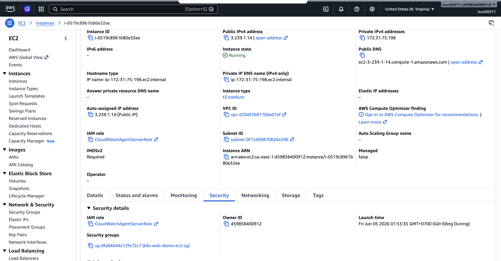
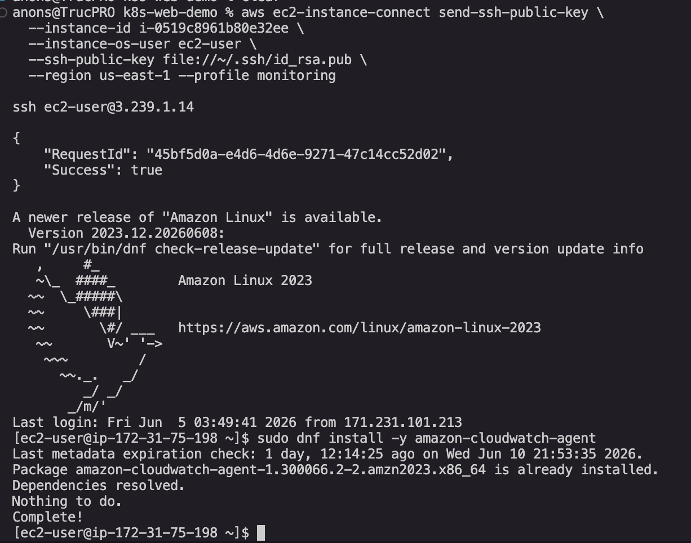
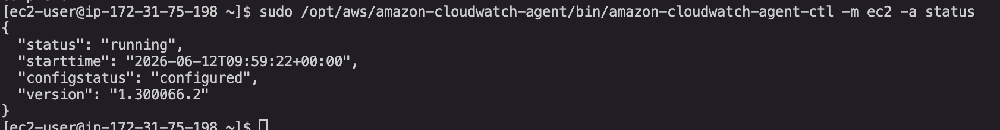
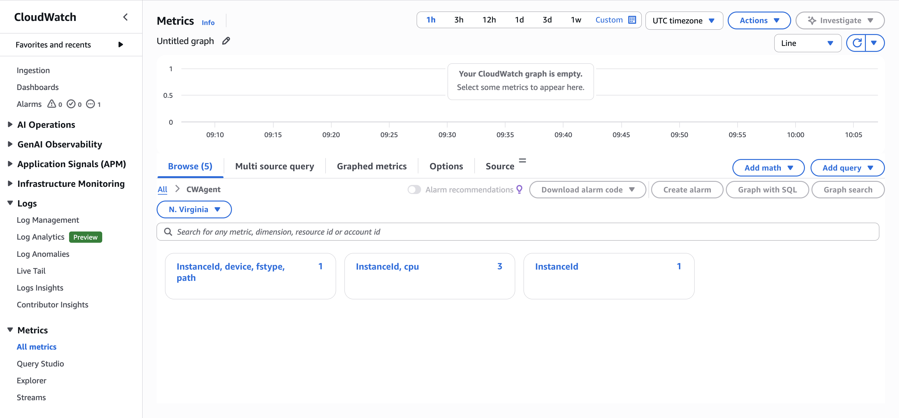

# Bộ Bằng Chứng W9 - Cài Đặt CloudWatch Agent trên EC2

## Mục Tiêu

Tạo bằng chứng cho kịch bản thực hành (Session 02):

- Cài đặt CloudWatch Agent lên EC2 instance.
- Cấu hình agent thu thập metrics CPU, Memory, Disk.
- Enable và Start agent bằng `systemctl`.
- Xác minh trạng thái agent `running` + `configured`.

## Thông Tin Tài Nguyên Đã Tạo

| Tài nguyên | Giá trị |
|---|---|
| AWS Account | `459858400912` |
| Region | `us-east-1` |
| EC2 Instance ID | `i-0519c8961b80e32ee` |
| Public IP | `3.239.1.14` |
| OS | Amazon Linux 2023 |
| IAM Role | `CloudWatchAgentServerRole` |
| IAM Policy | `CloudWatchAgentServerPolicy` |
| Instance Profile | `CloudWatchAgentServerProfile` |
| Agent version | `1.300066.2` |
| Thời gian cài | `2026-06-12T09:59:22 UTC` |

## Kết Quả CLI Thực Tế

### 01 - Xác thực danh tính AWS

```json
{
    "UserId": "459858400912",
    "Account": "459858400912",
    "Arn": "arn:aws:iam::459858400912:root"
}
```

### 02 - IAM Role đã tạo và attach

```json
{
    "Role": "CloudWatchAgentServerRole",
    "Arn": "arn:aws:iam::459858400912:role/CloudWatchAgentServerRole",
    "AttachedPolicy": "arn:aws:iam::aws:policy/CloudWatchAgentServerPolicy",
    "InstanceProfile": "arn:aws:iam::459858400912:instance-profile/CloudWatchAgentServerProfile",
    "AttachedTo": "i-0519c8961b80e32ee"
}
```

### 03 - Kết quả cài đặt agent

```
Installed:
  amazon-cloudwatch-agent-1.300066.2-2.amzn2023.x86_64

Complete!
```

### 04 - Trạng thái agent

```json
{
  "status": "running",
  "starttime": "2026-06-12T09:59:22+00:00",
  "configstatus": "configured",
  "version": "1.300066.2"
}
```

## Cấu Trúc Thư Mục

```text
evidence-cw-agent/
  evidence-pack.md
  screenshots/
    01-iam-role-policy.png              ✅ đã có
    02-install-agent.png                ✅ đã có
    03-agent-status.png                 ✅ đã có
    04-cloudwatch-metrics.png           ✅ đã có
  src/
    install_cloudwatch_agent.sh
  cli-output/
    01-sts-identity.json                ✅ đã có
    02-iam-role.json                    ✅ đã có
    03-install-output.txt               ✅ đã có
    04-agent-status.json                ✅ đã có
```

## Bằng Chứng - Ảnh Chụp Màn Hình

### 01 - IAM Role & Policy



---

### 02 - Cài Đặt Agent



---

### 03 - Trạng Thái Agent



---

### 04 - CloudWatch Metrics



---

## Tài Liệu Tham Khảo AWS

- [Installing the CloudWatch Agent](https://docs.aws.amazon.com/AmazonCloudWatch/latest/monitoring/install-CloudWatch-Agent-on-EC2-Instance.html)
- [CloudWatchAgentServerPolicy](https://docs.aws.amazon.com/AmazonCloudWatch/latest/monitoring/create-iam-roles-for-cloudwatch-agent.html)
- [CloudWatch Agent CTL reference](https://docs.aws.amazon.com/AmazonCloudWatch/latest/monitoring/install-CloudWatch-Agent-commandline-fleet.html)
