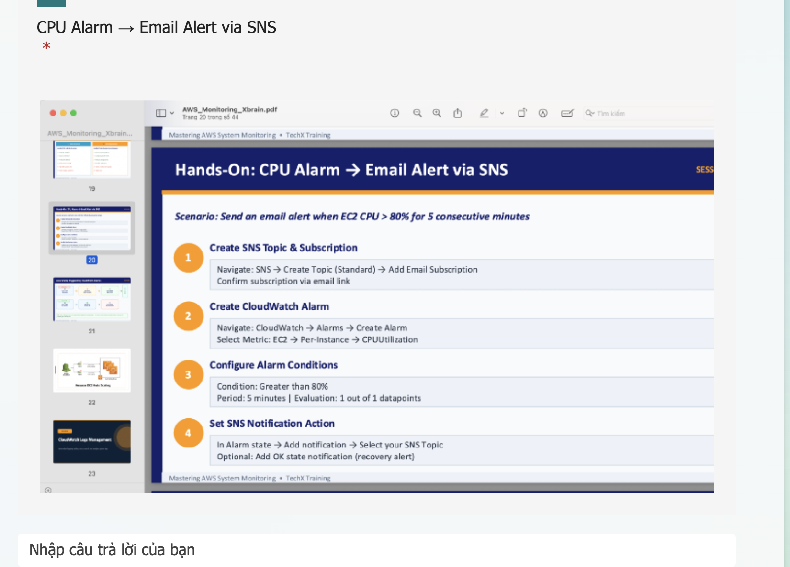
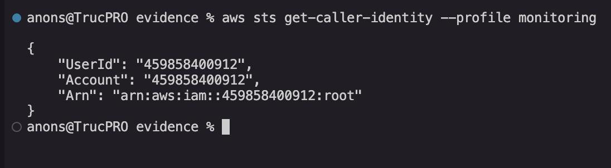
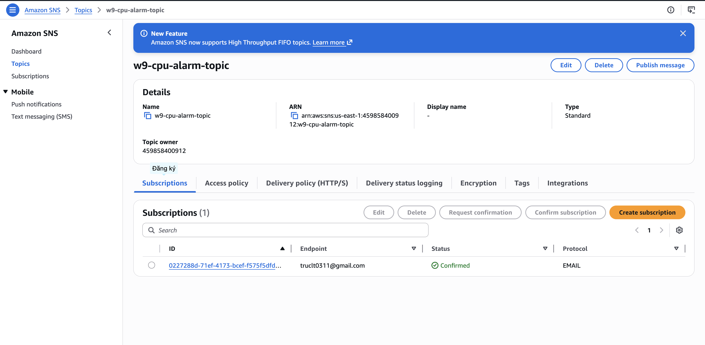
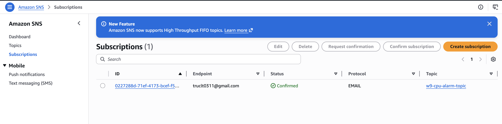
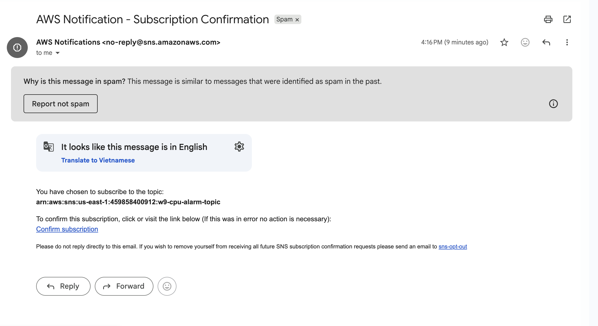
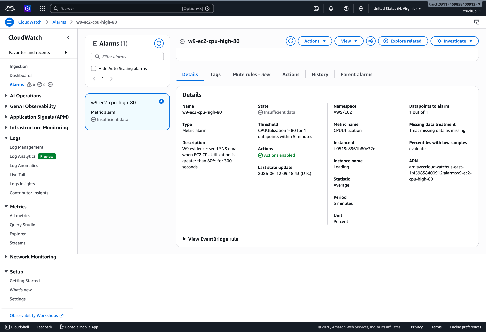
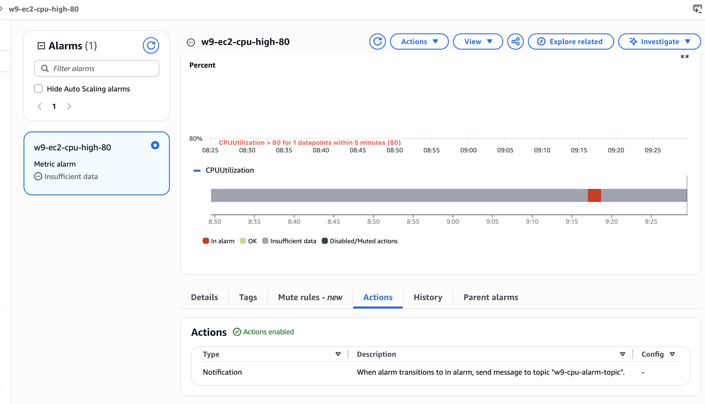
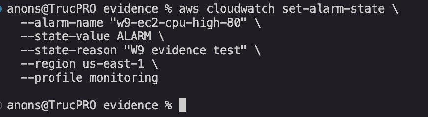
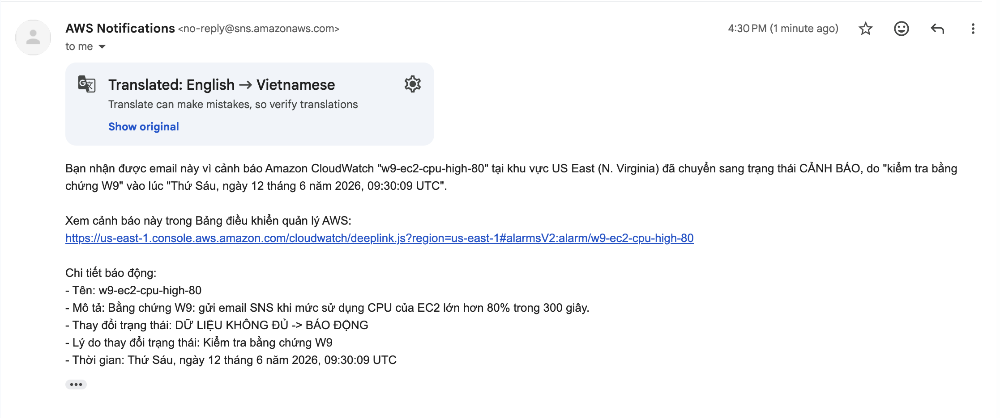

# Bộ Bằng Chứng W9 - Cảnh Báo CPU Gửi Email Qua SNS

## Mục Tiêu

Tạo bằng chứng cho kịch bản thực hành:

- Gửi cảnh báo email khi CPU của EC2 instance vượt quá 80%.
- Dùng Amazon SNS để gửi thông báo qua email.
- Dùng Amazon CloudWatch alarm theo dõi metric `CPUUtilization` của EC2.
- Dùng AWS CLI với profile `monitoring`.

## Thông Tin Tài Nguyên Đã Tạo

| Tài nguyên | Giá trị |
|---|---|
| AWS Account | `459858400912` |
| Region | `us-east-1` |
| EC2 Instance ID | `i-0519c8961b80e32e` |
| SNS Topic | `w9-cpu-alarm-topic` |
| SNS Topic ARN | `arn:aws:sns:us-east-1:459858400912:w9-cpu-alarm-topic` |
| CloudWatch Alarm | `w9-ec2-cpu-high-80` |
| Alarm ARN | `arn:aws:cloudwatch:us-east-1:459858400912:alarm:w9-ec2-cpu-high-80` |
| Email nhận cảnh báo | `truclt0311@gmail.com` |
| Ngưỡng CPU | `> 80%` |
| Chu kỳ | `300 giây (5 phút)` |
| Thời gian tạo | `2026-06-12T16:16:05 +07:00` |

## Kết Quả CLI Thực Tế

### 01 - Xác thực danh tính AWS

```json
{
    "UserId": "459858400912",
    "Account": "459858400912",
    "Arn": "arn:aws:iam::459858400912:root"
}
```

### 02 - SNS Topic ARN

```
arn:aws:sns:us-east-1:459858400912:w9-cpu-alarm-topic
```

### 03 - SNS Email Subscription

```json
{
    "SubscriptionArn": "pending confirmation"
}
```

> Trạng thái `pending confirmation` — cần vào hộp thư `truclt0311@gmail.com` bấm **Confirm subscription**.

### 04 - CloudWatch Alarm (describe-alarms)

```json
{
    "MetricAlarms": [
        {
            "AlarmName": "w9-ec2-cpu-high-80",
            "AlarmArn": "arn:aws:cloudwatch:us-east-1:459858400912:alarm:w9-ec2-cpu-high-80",
            "AlarmDescription": "W9 evidence: send SNS email when EC2 CPUUtilization is greater than 80% for 300 seconds.",
            "AlarmConfigurationUpdatedTimestamp": "2026-06-12T16:16:05.292000+07:00",
            "ActionsEnabled": true,
            "AlarmActions": [
                "arn:aws:sns:us-east-1:459858400912:w9-cpu-alarm-topic"
            ],
            "StateValue": "INSUFFICIENT_DATA",
            "StateReason": "Unchecked: Initial alarm creation",
            "MetricName": "CPUUtilization",
            "Namespace": "AWS/EC2",
            "Statistic": "Average",
            "Dimensions": [
                {
                    "Name": "InstanceId",
                    "Value": "i-0519c8961b80e32e"
                }
            ],
            "Period": 300,
            "Unit": "Percent",
            "EvaluationPeriods": 1,
            "DatapointsToAlarm": 1,
            "Threshold": 80.0,
            "ComparisonOperator": "GreaterThanThreshold",
            "TreatMissingData": "missing"
        }
    ]
}
```

## Cấu Trúc Thư Mục Thực Tế

```text
evidence/
  evidence-pack.md
  screenshots/
    00-requirement-reference.png        ✅ đã có
    01-cli-identity.png                 ✅ đã có
    02-sns-topic-created.png            ✅ đã có
    03-sns-email-subscription.png       ✅ đã có
    04-email-subscription-confirmed.png ✅ đã có
    05-cloudwatch-alarm-created.png     ✅ đã có
    06-alarm-notification-action.png    ✅ đã có
    07-alarm-state-test.png             ✅ đã có
    08-email-alert-received.png         ✅ đã có
  src/
    create_cpu_alarm_resources.sh
  evidence/
    cli-output/
      01-sts-get-caller-identity.json   ✅ đã có
      02-sns-topic-arn.txt              ✅ đã có
      03-sns-subscribe.json             ✅ đã có
      04-describe-alarm.json            ✅ đã có
      05-next-steps.txt                 ✅ đã có
```

## Bằng Chứng - Ảnh Chụp Màn Hình

### 00 - Yêu Cầu Đề Bài



---

### 01 - Danh Tính CLI

Lệnh:
```bash
aws sts get-caller-identity --profile monitoring
```



---

### 02 - SNS Topic Đã Tạo

AWS Console: `SNS → Topics → w9-cpu-alarm-topic`



---

### 03 - SNS Email Subscription

AWS Console: `SNS → Subscriptions`



---

### 04 - Email Subscription Đã Xác Nhận



---

### 05 - CloudWatch Alarm Đã Tạo

AWS Console: `CloudWatch → Alarms → All alarms → w9-ec2-cpu-high-80`



---

### 06 - Hành Động Thông Báo Alarm

Chi tiết alarm → phần **Actions / Notification**



---

### 07 - Test Trạng Thái Alarm

Lệnh:
```bash
aws cloudwatch set-alarm-state \
  --alarm-name "w9-ec2-cpu-high-80" \
  --state-value ALARM \
  --state-reason "W9 evidence test" \
  --region us-east-1 \
  --profile monitoring
```



---

### 08 - Email Cảnh Báo Đã Nhận

Hộp thư: `truclt0311@gmail.com`



---

## Script CLI

Đường dẫn script:

```bash
evidence/src/create_cpu_alarm_resources.sh
```

Thiết lập biến và chạy:

```bash
export AWS_PROFILE_NAME="monitoring"
export AWS_REGION="us-east-1"
export ALERT_EMAIL="truclt0311@gmail.com"
export INSTANCE_ID="i-0519c8961b80e32e"

./evidence/src/create_cpu_alarm_resources.sh
```

## Lệnh CLI Thủ Công (từng bước)

Thiết lập biến:

```bash
export AWS_PROFILE_NAME="monitoring"
export AWS_REGION="us-east-1"
export ALERT_EMAIL="truclt0311@gmail.com"
export INSTANCE_ID="i-0519c8961b80e32e"
export TOPIC_NAME="w9-cpu-alarm-topic"
export ALARM_NAME="w9-ec2-cpu-high-80"
export TOPIC_ARN="arn:aws:sns:us-east-1:459858400912:w9-cpu-alarm-topic"
```

Kiểm tra danh tính:

```bash
aws sts get-caller-identity --profile "$AWS_PROFILE_NAME"
```

Tạo SNS topic:

```bash
TOPIC_ARN=$(aws sns create-topic \
  --name "$TOPIC_NAME" \
  --region "$AWS_REGION" \
  --profile "$AWS_PROFILE_NAME" \
  --query 'TopicArn' \
  --output text)

echo "$TOPIC_ARN"
```

Tạo email subscription:

```bash
aws sns subscribe \
  --topic-arn "$TOPIC_ARN" \
  --protocol email \
  --notification-endpoint "$ALERT_EMAIL" \
  --region "$AWS_REGION" \
  --profile "$AWS_PROFILE_NAME"
```

Tạo CloudWatch alarm:

```bash
aws cloudwatch put-metric-alarm \
  --alarm-name "$ALARM_NAME" \
  --alarm-description "W9 evidence: send SNS email when EC2 CPUUtilization is greater than 80% for 5 minutes." \
  --metric-name CPUUtilization \
  --namespace AWS/EC2 \
  --statistic Average \
  --period 300 \
  --threshold 80 \
  --comparison-operator GreaterThanThreshold \
  --dimensions "Name=InstanceId,Value=${INSTANCE_ID}" \
  --evaluation-periods 1 \
  --datapoints-to-alarm 1 \
  --alarm-actions "$TOPIC_ARN" \
  --unit Percent \
  --treat-missing-data missing \
  --region "$AWS_REGION" \
  --profile "$AWS_PROFILE_NAME"
```

Kiểm tra alarm:

```bash
aws cloudwatch describe-alarms \
  --alarm-names "$ALARM_NAME" \
  --region "$AWS_REGION" \
  --profile "$AWS_PROFILE_NAME"
```

## Test & Reset Alarm

Test kích hoạt cảnh báo:

```bash
aws cloudwatch set-alarm-state \
  --alarm-name "w9-ec2-cpu-high-80" \
  --state-value ALARM \
  --state-reason "W9 evidence test" \
  --region us-east-1 \
  --profile monitoring
```

Reset về OK sau khi chụp bằng chứng:

```bash
aws cloudwatch set-alarm-state \
  --alarm-name "w9-ec2-cpu-high-80" \
  --state-value OK \
  --state-reason "W9 evidence reset" \
  --region us-east-1 \
  --profile monitoring
```

## Dọn Dẹp Tài Nguyên

> Chỉ chạy sau khi đã chụp đủ bằng chứng.

```bash
aws cloudwatch delete-alarms \
  --alarm-names "w9-ec2-cpu-high-80" \
  --region us-east-1 \
  --profile monitoring

aws sns delete-topic \
  --topic-arn "arn:aws:sns:us-east-1:459858400912:w9-cpu-alarm-topic" \
  --region us-east-1 \
  --profile monitoring
```

## Tài Liệu Tham Khảo AWS

- [AWS CloudWatch - Create a CPU usage alarm using AWS CLI](https://docs.aws.amazon.com/AmazonCloudWatch/latest/monitoring/US_AlarmAtThresholdEC2.html)
- [AWS CloudWatch PutMetricAlarm](https://docs.aws.amazon.com/cli/latest/reference/cloudwatch/put-metric-alarm.html)
- [AWS SNS Subscribe](https://docs.aws.amazon.com/cli/latest/reference/sns/subscribe.html)
